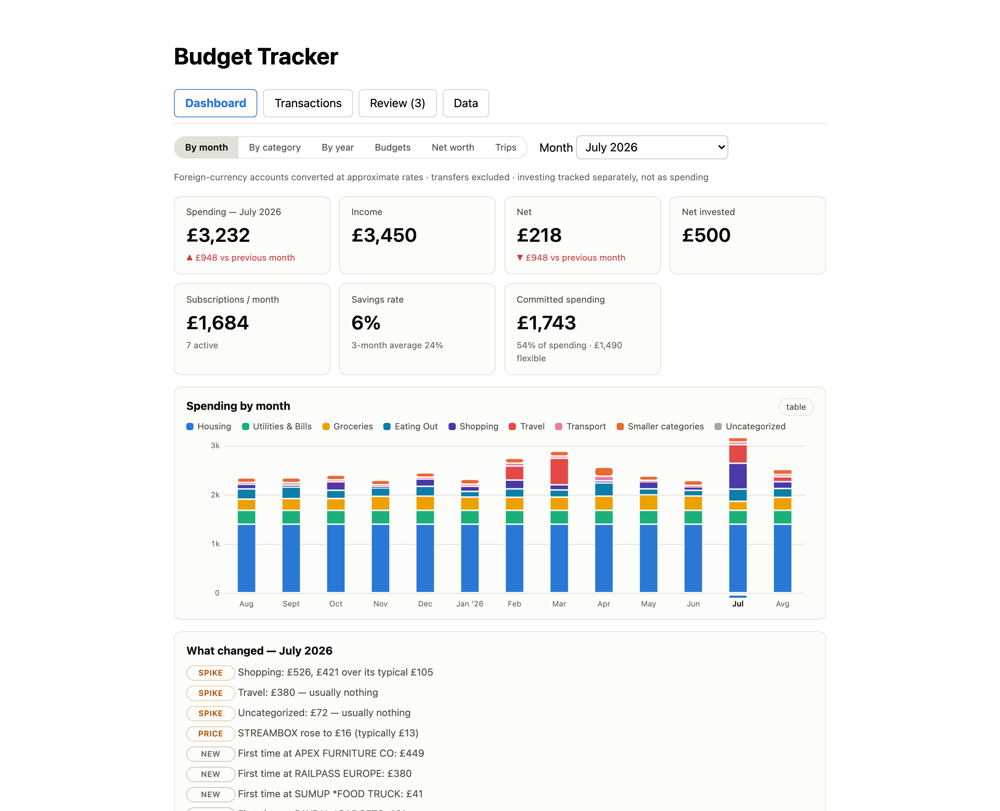
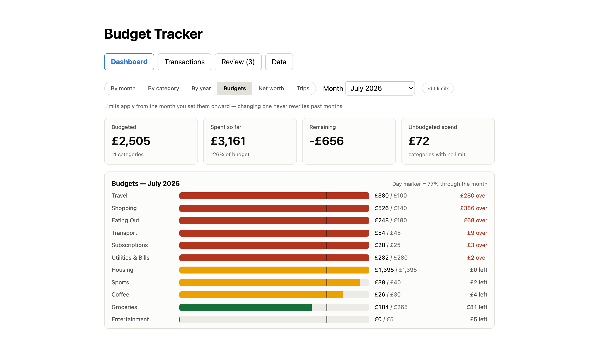

# Budget Tracker

A personal, self-hosted spending tracker for UK bank accounts, fed by CSV
imports (and optionally the Monzo API), with a categorization engine that
learns from corrections and a dashboard built to teach you something rather
than just file transactions.

Single-user, non-commercial. See [ROADMAP.md](ROADMAP.md) for the plan,
[PRIVACY.md](PRIVACY.md) for the privacy notice, and [TERMS.md](TERMS.md)
for terms of use.





*Screenshots show generated demo data ([scripts/seed_demo.py](scripts/seed_demo.py)) — never real finances.*

## Try it with demo data

No bank exports needed — seed a fictional-but-realistic dataset and browse:

```sh
DATA_DIR=/tmp/budget-demo backend/.venv/bin/python scripts/seed_demo.py
DATA_DIR=/tmp/budget-demo STATIC_DIR=frontend/dist \
  backend/.venv/bin/uvicorn app.main:app --app-dir backend --port 8000
```

Then open http://localhost:8000. (Requires the venv and a built frontend —
see "Running" below. The seeder refuses to touch an existing database.)

## What it does

**Getting data in**

- Drag-and-drop import of CSV / Excel exports and Barclays PDF statements —
  drop files anywhere in the app; the bank and format are detected
  automatically and re-imports are deduplicated.
- Per-bank importers (Amex, Barclays, Barclaycard, Revolut, Monzo), plus
  optional live sync from the Monzo personal API.
- **Splitwise** integration: pulls your shared-expense balances and applies
  corrections so a split bill only ever counts your actual share.
- A **Data** tab with a coverage heatmap showing which accounts have data for
  which months, and a staleness nudge when an account hasn't been fed lately.

**Categorization**

- Layered categorizer, each layer firing only when the previous abstains:
  deterministic rules → a local ML model (trained on your own corrections) →
  the Claude API as a fallback → a human review queue.
- Merchant-grouped review queue with one-click "always categorize X as Y"
  rules, plus a "second opinions" audit that flags automatic labels the local
  model confidently disagrees with.

**Multi-account intelligence**

- Automatic transfer detection links both legs of money moved between your own
  accounts (card payments, top-ups) so they never count as spending or income.
- Investing is tracked as a separate net-invested figure rather than as
  spending or income; unknown-currency rows are excluded from GBP totals
  rather than converted at a wrong rate, and reported so the total is honest.

**Dashboards & insights**

- Monthly spending stacked by category, income vs spending, per-month
  detail, an average-of-the-last-12-months pseudo-month, a per-category
  drill-down with merchant tables and trends, and a whole-year view with each
  category's share of the year.
- **Savings rate** and a **committed-vs-discretionary** split of each month's
  spending.
- Recurring-payment / subscription detection with price-change flags and
  next-expected dates.
- A **"what changed this month"** panel: category spikes vs the trailing-12
  median, subscription price changes, lapsed subscriptions, first-ever
  merchants, and the largest one-off payments — computed locally, nothing
  sent anywhere.
- Click any category, merchant, or month figure to drill through to the
  transactions behind it.

**Trips**

- Group spending into named, date-bounded trips (orthogonal to categories, so
  a dinner abroad is still Eating Out *and* part of the trip). Claude reviews
  every candidate payment in the trip window — plus four months before for
  prepaid flights and hotels and a month after for late charges — and suggests
  which belong; you confirm. Trip totals never distort the regular stats.

## Running (development)

```sh
./dev.sh
```

Starts the FastAPI backend on http://localhost:8000 and the Vite frontend on
http://localhost:5173 (open this one). Requires `backend/.venv` (create with
`python3 -m venv backend/.venv && backend/.venv/bin/pip install -r backend/requirements.txt`)
and Node (expected at `~/.local/node`, or on PATH).

## Running (Docker)

```sh
docker compose up --build
```

Serves the whole app on http://localhost:8000.

## Where the data lives

All financial data stays outside the repository, in `~/FinanceData/`
(override with the `DATA_DIR` env var): the SQLite database at its root and
bank CSV exports in `bank-exports/`. Import CSVs through the app's drop-zone
directly from wherever they were downloaded — they never need to enter the
project folder. Nothing under the project directory holds financial data,
and export formats are gitignored as a second line of defence.

## Backups & export

You're never locked in:

- **`scripts/backup.sh`** — a consistent, timestamped, gzipped copy of the
  SQLite database (keeps the last 14; honours `DATA_DIR`). Run it by hand or
  from cron (`0 3 * * * /path/to/scripts/backup.sh` for a nightly backup).
- **Data tab → Export** — download every transaction as CSV, or a complete
  JSON dump of all your data (accounts, categories, rules, transactions,
  budgets, balance snapshots, rate overrides, trips).
